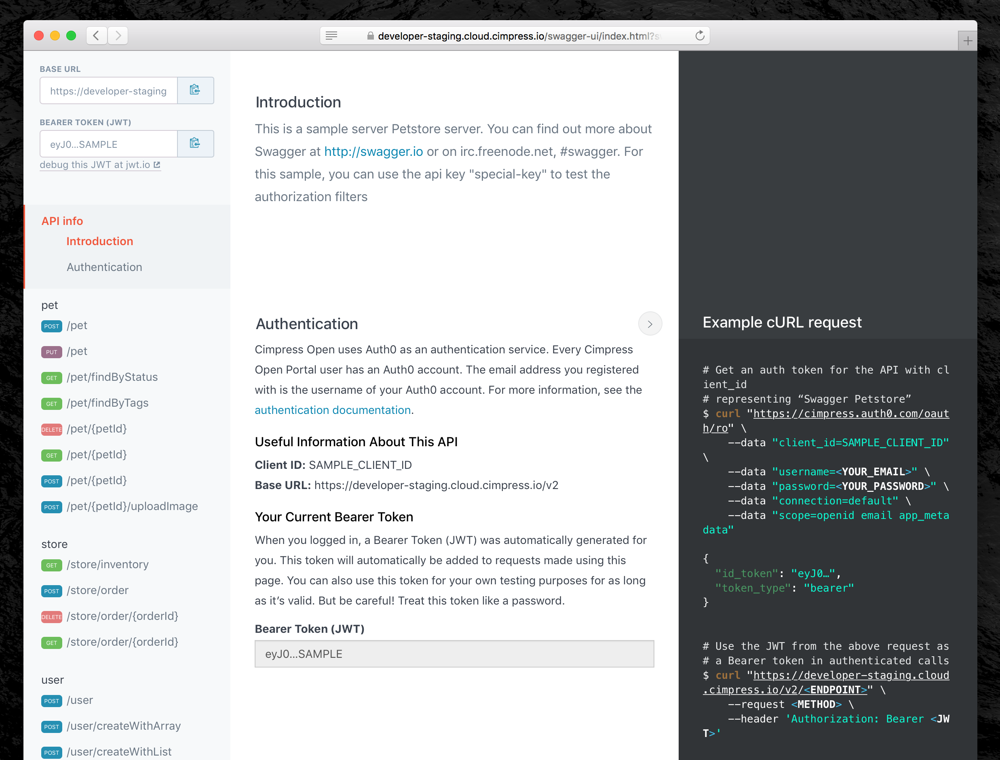

# swagger-ui-cimpress

A swagger-ui fork with an easy to read, responsive three pane view. Used on https://developer.cimpress.io.

Swagger UI uses client-side Javascript (jQuery + Backbone) to download a swagger.json resource and make "Try It" requests to the described endpoints. You can learn more about the swagger-ui project at the upstream source: https://github.com/swagger-api/swagger-ui

## Acknowledgement

This is a fork of https://github.com/jensoleg/swagger-ui which is a fork of https://github.com/swagger-api/swagger-ui

## Developers

Cimpress Employees can deploy builds to Cimpress Open, but first you'll have to set up credentials.

    # Install aws-cli and configure credentials to right AWS account
    # For more info, see https://docs.aws.amazon.com/cli/latest/userguide/cli-chap-welcome.html
    pip install awsebcli --upgrade
    aws configure

    # Build the project
    $ yarn run build

    # Deploy to 'integration', 'staging', or 'production'
    $ yarn run deploy:integration
